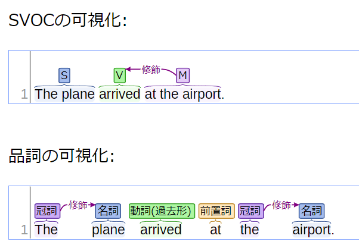
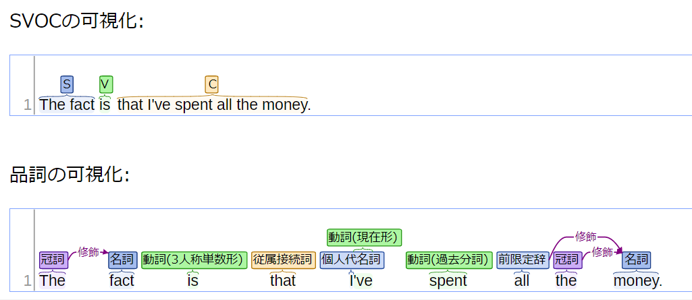
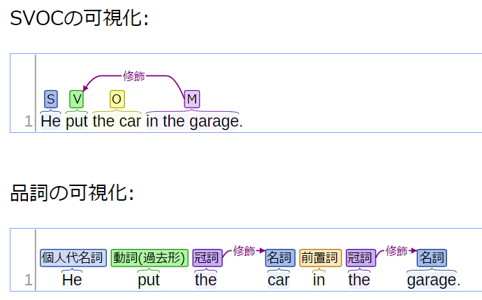
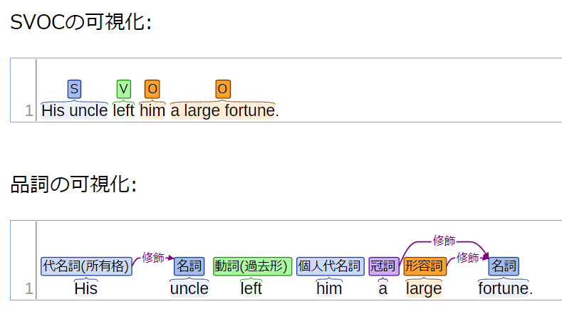
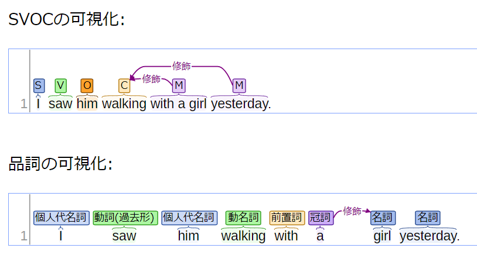

# SVOCの可視化ツール
## 実行の仕方1（CLI）
1. 本リポジトリをローカルにダウンロードし、srcフォルダに移動する    
2. コマンドラインから `pip install stanza` を実行する  
3. `main.py` を実行して解析したい文章を入力する  
4. outputフォルダにある `output.html` が更新されるのでそれをダブルクリック等で開く  

## 実行の仕方2（Webアプリ）
1. 本リポジトリをローカルにダウンロードし、server-srcフォルダに移動する   
2. `pip install stanza`  
3. `pip install Flask`  
4. `python -c "import stanza; stanza.download('en')"`  
5. `app.py` を実行
6. ブラウザから `localhost:5001` にアクセスする

## 解析時の注意点
まず前提として、この解析器は1文ずつしか実行できないので、複数文から成る文章を解析したい場合は1文ずつ実行する必要がある。1文が長いときアノテーション（SVOCの割り当てなど）がうまくいかないことがある。そういうときは、その文をさらに複数の文に分けたうえで解析器にかけるとうまくいくことがある。  
例えば以下のような文章を解析したいとき  
- I like apple, orange, and squash. However, I ate banana.  
  
次のように分けると良い。  
- I like apple.  
- I like orange.  
- I like squash.  
- However, I ate banana.  
  
※この例は説明のために簡単なものを選んだので、実際はこの程度の長さの文なら以下のように2文に分けるだけで適切にアノテーションしてくれる。  
- I like apple, orange, and squash.  
- However, I ate banana.   

## 解析結果の例
### SV型
  
### SVC型
  
### SVO型
  
### SVOO型
  
### SVOC型
  
